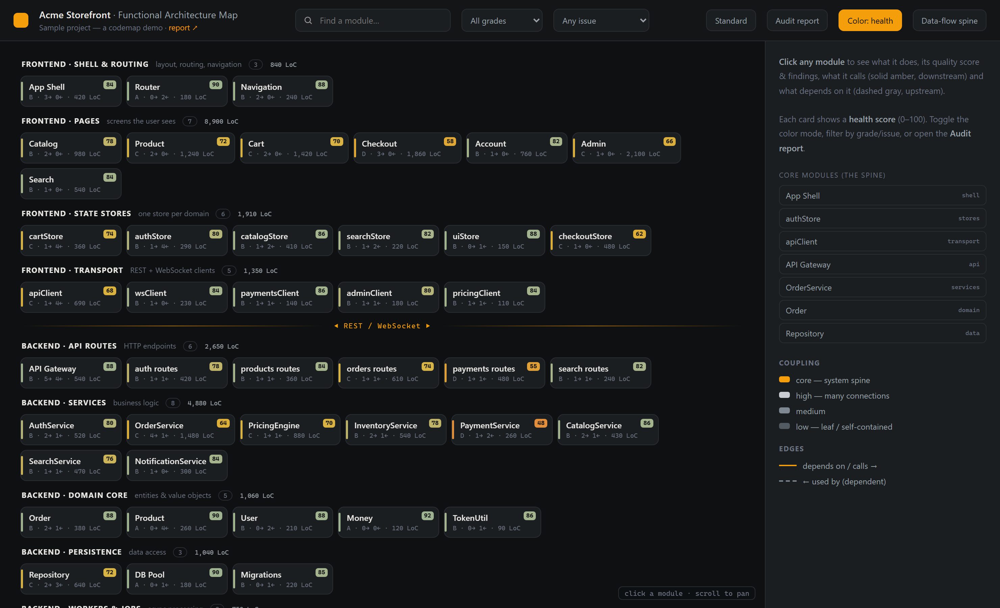
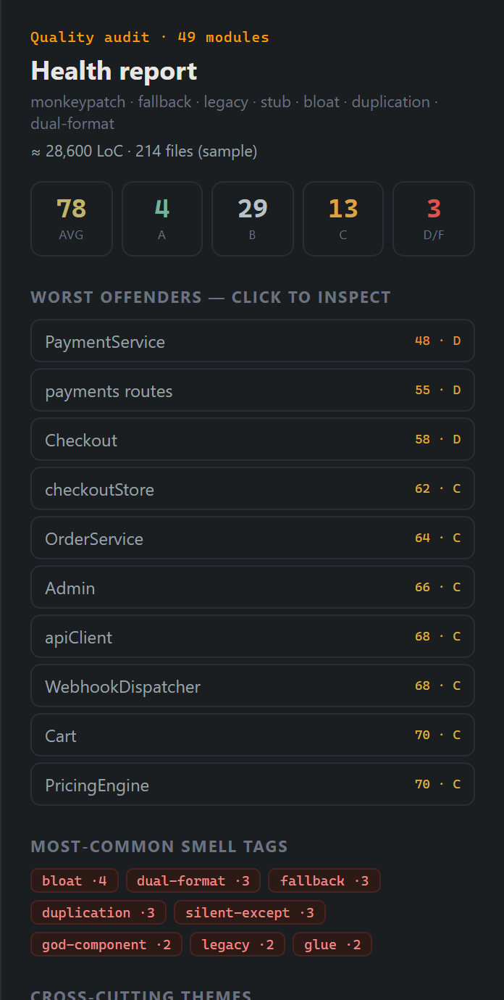

# 🧹 codemap

**A code janitor for AI coding agents.** Point it at any repo and it draws an
**interactive architecture map**, scores **every module 0–100** for technical debt, and
helps you **pay down the cruft** — incrementally, one commit at a time.


[](https://github.com/liujianpeng678-hash/architecture-review-plus/actions/workflows/test.yml)

> Every codebase accumulates cruft over time — monkeypatches, silent fallbacks, dead
> "legacy" paths, half-finished stubs, copy-pasted duplication, god-files, and valueless
> glue. **codemap surfaces that rot, ranks it, and hands an AI agent a clear punch-list to
> fix it** — with a regression-gated fix loop: a change is accepted only when evidence shows the original problem is resolved and required behavior is preserved.
> High-risk fixes require independent acceptance; local fixes may use disclosed self-review.



---

## Install

The current skill is published at the root of
[`liujianpeng678-hash/architecture-review-plus`](https://github.com/liujianpeng678-hash/architecture-review-plus).
Clone the repository into your agent's skills directory (for Codex:
`~/.codex/skills/architecture-review-plus/`). Replace an older installation rather than
keeping duplicate registrations. Restart or open a new session and invoke
**`$architecture-review`**.

Keep all scripts, references and assets together. This version replaces the previous
repository-root implementation. Project audit data lives in the project's `.codemap/`
directory, not inside the installed skill.

## Why codemap

Most "architecture diagram" tools draw *files and imports*. codemap is different:

- **Functional modules, not files.** It groups code into the capabilities that actually
  matter (a store, a handler group, a feature, a plugin) and lays them out along the
  real data-flow.
- **It grades the rot.** Every module gets a health **score (0–100) and grade (A–F)** plus
  concrete `file:line` findings, hunting specifically for the smells that make code
  unmaintainable: `monkeypatch`, `fallback`, `silent-except`, `legacy`/dead code, `stub`,
  `fake-output`, `dual-format`, `bloat`, `duplication`, `glue`, `god-component`, …
- **Evidence-backed scoring.** Every module has its own assessment against a fixed
  rubric, with coverage and reviewer mode disclosed. Prefer authorized independent
  review; triage remains unscored.
- **Incremental + git-aware.** A per-module content hash + the last-run commit mean re-runs
  re-audit changed modules and affected conclusion dependencies, and `update` shows you the **commits since last time** and
  which modules they touched.
- **Retained website/game audits.** At explicit reviews, milestones, or high-impact
  boundaries beyond focused checks, the first completed audit is retained as a full
  immutable version; later triggered reviews create
  incremental versions with source and module deltas instead of rewriting history.
- **Regression-gated cleanup.** `fix` captures baseline checks and target reproductions,
  repairs the problem, verifies resolution and regression safety, then re-audits.
  High-risk fixes require independent acceptance; unavailable verification stays pending.

It's the maintenance pass you never have time to do, turned into something an agent can
run on a schedule.

> **What it is (and isn't).** codemap is an agent-orchestration framework that makes the
> map + audit *consistent and reviewable* — deterministic scripts handle LoC, hashing,
> staleness, filtering and rendering, and a fixed rubric forces `file:line` evidence and
> a coverage-declared assessment per module. But the **module decomposition and the scores are model
> judgments**, not the output of a deterministic static analyzer. Treat the map as a
> high-quality, reviewable starting point — and commit `modules.json` so every score is
> diffable in PRs.

Want to see it before installing? Open
**[`examples/sample-project/codemap.html`](examples/sample-project/codemap.html)** — a
fully rendered demo (the sample used for the screenshots).

## Screenshots

**Click any module** to highlight what it calls (downstream) and what depends on it
(upstream), with its score, smell tags, and `file:line` findings:


The **Audit report** — averages, grade spread, worst offenders, smell-tag frequency, and
cross-cutting themes:



- **Health vs coupling** color modes — problems pop amber/red, healthy modules recede to a
  muted green (colorblind-friendly; the cue is saturation, not just hue).
- **Filter** by grade (≤ B/C/D/F) or by issue tag; jump straight to the worst offenders.
- **Editable Standard page** — change descriptions, **add your own issue tags** to capture
  *your* definition of a problem, and Export to `standard.json`; future audits use it.
- **i18n** — English or Chinese UI (`meta.lang`); module names are never translated.
- **Copy-fix button** on each module — copies `/codemap fix <module>` to paste into your agent.

## Languages

Language-agnostic. LoC and hashing work on **any** text source and `paths` are plain globs,
so it covers **Python, TypeScript/JS, Rust, C#/.NET, C/C++, Go, Java, Swift**, and more.

## Requirements

- **Python 3** — standard library only. No `pip install`, no external packages.
- **An AI coding agent** to drive the audit/fix/test steps — **Claude Code**, **Codex**,
  **Cursor**, or any agent that reads instructions and spawns sub-tasks (see Install).
- A browser to open the generated HTML. That's it.

## Usage

Talk to your agent in plain language, or use the subcommands (shown as Claude Code slash
commands — say the same verb to any other agent). On the first run, codemap asks your
preferences (UI language, output location, project title) and saves them to
`<project>/.codemap/config.json`. Everything it produces lives in `<project>/.codemap/`.

| Command | Does |
|---|---|
| `/codemap init` | first build: ask prefs → decompose into modules → scan → audit every module → render |
| `/codemap check` | read-only: is the map stale? shows commits since last run + drifted / new / deleted modules |
| `/codemap update` | incremental + git-aware: re-audit only changed modules, re-render |
| `/codemap version status` | compare current website/game source and audit state with the latest retained version |
| `/codemap version publish` | retain a completed full or incremental audit as the next immutable version |
| `/codemap version verify` | independently verify retained bytes, audit semantics, compatibility and the version chain |
| `/codemap test <module>` | generate a regression-net of tests for a module |
| `/codemap fix <module>` | regression-gated cleanup: lock baseline → fix → risk-proportionate acceptance → re-score |

## How it works

```
modules.json  ──scan.py──▶  + LoC, content hash & git diff (stale = hash != auditedHash)
     │                       (decomposition + module descriptions: authored by the agent)
     │◀─apply_audit.py──   one module assessment, validated + atomically written
     │◀─query.py──────────  token-cheap targeting (by grade / tag / severity / staleness)
     ├──render.py────────▶  codemap.html + codemap.md
     └──version.py───────▶  shared semantic preflight + receipt + immutable hash chain
```

`modules.json` is the source of truth (commit it for an audit history); only its
decomposition/structural fields are hand-maintained. Audit facts (`score`, `grade`,
`tags`, `findings`, `audited*`) are accepted only through `apply_audit.py`. The HTML/MD
are pure projections, regenerated by `render.py`. Reviewer roles follow risk and authorized delegation. High-risk fixes need independent
acceptance; local fixes may use disclosed self-review. Tests remain evidence for
safeguards and defect resolution even when excluded from production LoC. Coverage,
scenario and conclusion-dependency notes are retained in `reportThemes`.

### Reading verification results

`version.py verify` reports separate trust layers: `integrityValid` proves retained
bytes and the hash chain are unchanged; `semanticValid` proves those bytes still satisfy
the shared audit contract; `compatibilityStatus` says whether the history uses the
current receipt contract, a read-only legacy contract, or is semantically invalid.
**A valid hash alone never proves that an audit is meaningful.**

## Customizing the standard (define your own code smells)

The scoring standard is **data, not code** (`reference/standard.json`: rubric, severities,
coupling, and issue tags with descriptions). Open the **Standard** page in the map → **Edit**
→ tweak descriptions, **add your own tags**, then **Export** to
`<project>/.codemap/standard.json`. Custom tags flow through the whole map and are used by
future audits. The prose version + the exact subagent prompt live in `reference/STANDARDS.md`.

## Repository layout

```
codemap/
  SKILL.md          # the orchestration the agent reads
  AGENTS.md         # entry point for agents without Skills support
  README.md
  LICENSE           # MIT
  reference/
    STANDARDS.md    # scoring rubric, smell taxonomy, severities, subagent prompts
    DATA_MODEL.md   # modules.json schema
    standard.json   # the machine-readable default standard (overridable per project)
  scripts/          # deterministic, stdlib-only Python
    audit_contract.py # shared schema + semantic invariants + receipt fingerprints
    audit_state.py  # validated optimistic/atomic modules.json write boundary
    scan.py         # LoC + content hash + git diff + staleness
    query.py        # filter modules (grade/tag/severity/…) → ids/paths/findings
    apply_audit.py  # validate + merge one subagent's audit into the state
    render.py       # modules.json → HTML + report
    version.py      # semantic preflight; retain and independently verify audit versions
  assets/
    template.html   # the interactive map shell (data injected at render time)
  tests/            # stdlib unittest golden tests for the scripts
  examples/
    01-map.png …    # the screenshots above
    sample-project/ # a fully rendered demo (modules.json + codemap.html/md)
  .github/workflows/test.yml   # CI: py_compile + unittest + render + JS syntax check
```

## License

[MIT](LICENSE) © 2026 Xingyu Chen.

---

<sub>Keywords: code quality · technical debt · refactoring · code janitor · legacy code
cleanup · architecture visualization · dependency graph · static analysis · code audit ·
Claude Code skill · Codex · AI agents · code rot · cruft · code smells.</sub>
